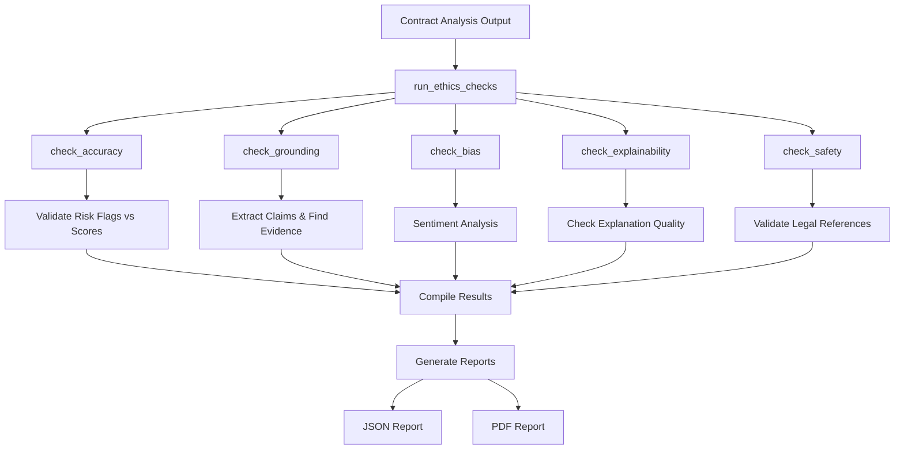

# AI Ethics Testing Process for Legal Contract Analysis

## Overview
This document outlines the comprehensive ethics testing framework implemented for the Legal Value Stream AI system. The framework ensures that AI-generated contract analyses meet ethical standards including accuracy, grounding, bias detection, explainability, and safety.

## Architecture Components

### 1. Core Ethics Module (`utils/ethics.py`)
The central component containing all ethics checking logic and reporting functions.

**Key Functions:**
- `run_ethics_checks()`: Main orchestrator that runs all ethics checks
- `check_accuracy()`: Validates risk flag consistency with risk scores
- `check_grounding()`: Ensures claims are grounded in provided context (no hallucinations)
- `check_bias()`: Analyzes output for biased language using sentiment analysis
- `check_explainability()`: Verifies explanations are substantive and not circular
- `check_safety()`: Prevents invention of case law or legal references

**Reporting Functions:**
- `save_ethics_report_json()`: Saves detailed JSON reports
- `save_ethics_report_pdf()`: Generates formatted PDF reports with visual indicators

### 2. Grounding Validation (`utils/check_grounding.py`)
Specialized module for hallucination detection using natural language processing.

**Process:**
1. Extracts claims from AI output using regex patterns
2. Finds most similar context chunks using sentence embeddings
3. Performs entailment checking to validate claims against evidence
4. Returns grounding risk assessment and detailed claim analysis

**Key Functions:**
- `extract_claims()`: Identifies factual claims in AI output
- `most_similar_chunk()`: Finds best matching context using cosine similarity
- `check_entailment()`: Validates logical consistency between claims and evidence

### 3. Integration Test Script (`test_ethics.py`)
End-to-end testing script that validates the ethics framework with real contract analysis data.

**Workflow:**
1. Loads contract analysis output from JSON files
2. Converts data to AI output format for testing
3. Runs comprehensive ethics checks
4. Generates console summary and saves detailed reports
5. Supports custom input/output paths via command line arguments

### 4. Dummy Data Generator (`write_dummy.py`)
Utility script for generating test data and validating report generation infrastructure.

**Purpose:**
- Creates sample ethics reports for testing
- Validates JSON and PDF report generation
- Provides baseline test data for development

## Ethics Check Process Flow



## Detailed Check Descriptions

### Accuracy Check
- **Purpose**: Ensures risk assessments are internally consistent
- **Method**: Validates that risk flags (RED/GREEN/YELLOW) align with risk scores (1-10 scale)
- **Example**: RED flags should have scores ≥7, GREEN flags should have scores ≤3

### Grounding Check
- **Purpose**: Prevents hallucinations by ensuring all claims are supported by input data
- **Method**: Uses sentence embeddings and entailment checking to validate claims against contract text
- **Threshold**: Claims must have >65% similarity and entailment confidence

### Bias Check
- **Purpose**: Detects biased or discriminatory language in AI outputs
- **Method**: Sentiment analysis to identify potentially biased content
- **Fallback**: Keyword-based detection if ML models unavailable

### Explainability Check
- **Purpose**: Ensures AI decisions are transparent and understandable
- **Method**: Validates explanations are substantive, not circular, and provide value
- **Checks**: Length, circular reasoning detection, information content

### Safety Check
- **Purpose**: Prevents AI from inventing legal precedents or case law
- **Method**: Scans for unauthorized legal references and fabricated citations
- **Validation**: Cross-references against approved legal knowledge base

## Report Generation

### JSON Report Structure
```json
{
  "timestamp": "2024-01-15T10:30:00Z",
  "overall_status": "PASS|FAIL",
  "accuracy": {
    "status": "PASS|FAIL",
    "is_accurate": true|false,
    "accuracy_issues": [...]
  },
  "grounding": {
    "status": "PASS|FAIL",
    "grounding_risk": false,
    "claims": [...]
  },
  "bias": {
    "status": "PASS|FAIL",
    "bias_score": 0.23,
    "label": "NEGATIVE"
  },
  "explainability": {
    "status": "PASS|FAIL",
    "explainable": true,
    "issues": [...]
  },
  "safety": {
    "status": "PASS|FAIL",
    "safe": true,
    "invented_references": [...]
  }
}
```

### PDF Report Features
- Professional formatting with color-coded status indicators
- Executive summary with overall pass/fail status
- Detailed breakdown of each ethics check
- Issue highlighting and recommendations
- Timestamp and generation metadata

## Usage Examples

### Running Integration Tests
```bash
# Test with default files
python test_ethics.py

# Test with custom input/output
python test_ethics.py analysis_output.json ./reports/
```

### Generating Dummy Reports
```bash
python write_dummy.py
```

### Using Ethics Module Directly
```python
from utils.ethics import run_ethics_checks, save_ethics_report

report = run_ethics_checks(
    ai_output=json_string,
    input_data=contract_text,
    risk_flags=risk_flags,
    context_chunks=chunks,
    contract_ref_file="reference.json"
)

save_ethics_report(report, "ethics_report.json", "ethics_report.pdf")
```

## Dependencies
- `transformers`: For bias detection and NLP tasks
- `sentence-transformers`: For grounding check embeddings
- `reportlab`: For PDF report generation
- `scikit-learn`: For similarity calculations
- `nltk`: For text processing utilities

## Maintenance Recommendations

1. **Regular Updates**: Keep ethics checks current with evolving AI ethics standards
2. **Performance Monitoring**: Track execution times, especially for embedding operations
3. **Threshold Tuning**: Regularly validate and adjust similarity/confidence thresholds
4. **Test Coverage**: Expand test cases to cover edge cases and new risk scenarios
5. **Model Updates**: Monitor for improved NLP models that could enhance accuracy

## File Organization Rationale

The separation of concerns across multiple files provides:
- **Modularity**: Each component can be updated independently
- **Testability**: Individual functions can be unit tested
- **Reusability**: Ethics functions can be imported by other modules
- **Maintainability**: Clear separation between testing, core logic, and specialized checks

This architecture ensures robust, comprehensive ethics validation for AI-powered legal contract analysis while maintaining flexibility for future enhancements.